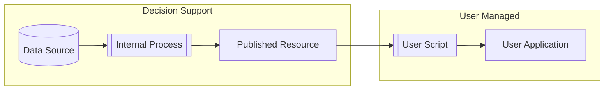

# Tableau API Examples

This repo is intended to provide a set of examples for OSU staff and partners to extract data from Tableau Server and integrate it into some arbitrary endpoint. These examples focus on writing to a CSV file in the present working directory.

## The Process

