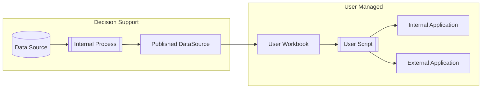

# Tableau API Examples

This repo is intended to provide a set of examples for OSU staff and partners to extract data from Tableau Server and integrate it into some arbitrary endpoint. These examples focus on writing to a CSV file in the present working directory.

## The Process

In most cases, Decision Support will provide information to users through resources published to our Tableau Server. This will be either a published data source, or a workbook. Users can then use this information within Tableau Server through standard work flows, or they can use the [Tableau API](https://help.tableau.com/current/api/rest_api/en-us/REST/rest_api.htm) to extract this information and integrate it into tools not supported by our team. 

If Decision Support provides a published data source (instead of a workbook), the user will need to create a workbook to extract information from. When a workbook is called from the API, the CSV output is exactly as it is found within the Workbook's view. This means the user is control of creating custom calculated fields, filters, and other dynamic content options as they see fit. Parameters are also supported through the API.

## Getting Started

Before getting started, you will need to obtain an API token from Tableau Server. Please see the [Tableau documentation](https://help.tableau.com/current/pro/desktop/en-us/useracct.htm#create-and-revoke-personal-access-tokens) for further information on obtaining your authentication token. Authentication with your username and password **is not supported** due to institution MFA requirements.

Once you have your authentication token, please see the README.md file found in each example's subfolder.

## Current Examples

- Python
    - [Download the HelioCampus data dictionary as a CSV file](./python-data-dictionary-to-csv)